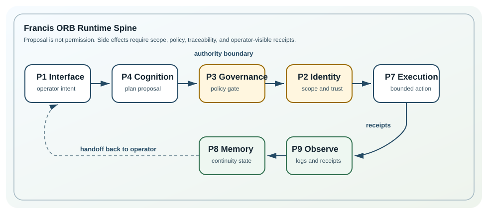

# Start Here

Francis is a local-first, policy-guarded, auditable AI operator layer for a personal computing environment. It is being built toward an OS-layer Digital Twin Operator, not a chatbot wrapper or a demo interface.

This page is a first-reader route for GitHub visitors. It explains where the repository is now, what to inspect first, and how to contribute without overstating the current build.

## Current Truth

Francis's current posture should be read from repo truth, not from a fixed phase label. The strongest shipped posture is a governed runtime spine: observability and governance are more mature than the product-facing operator surface.

- Strongest today: `P9_OBSERVABILITY` and `P3_GOVERNANCE`
- Partial and active: `P1_INTERFACE`, `P7_EXECUTION`, and `P8_MEMORY`
- Current priority: make the `plan -> gate -> execute -> trace -> memory` loop real, visible, and truthful

Use [docs/operations/COMPLETION_LEDGER.md](operations/COMPLETION_LEDGER.md) for shipped truth. Use [docs/canonical/ROADMAP.md](canonical/ROADMAP.md) and [docs/canonical/BUILD_MANIFEST.md](canonical/BUILD_MANIFEST.md) for target state and build order. Phase and stage names are orientation markers only; do not lock a build pass to one phase when the ledger and roadmap indicate a different active priority.

## Read This Path

1. [README.md](../README.md) for the public project overview, quick start, and validation commands.
2. [docs/operations/COMPLETION_LEDGER.md](operations/COMPLETION_LEDGER.md) for what is materially true in the repo.
3. [docs/canonical/BUILD_MANIFEST.md](canonical/BUILD_MANIFEST.md) for the current control plane and quality gates.
4. [docs/PLANES.md](PLANES.md) and [meta/plane_map.yaml](../meta/plane_map.yaml) for ORB plane responsibilities and transition rules.
5. [AGENTS.md](../AGENTS.md) and [CONTRIBUTING.md](../CONTRIBUTING.md) before making changes.

## Runtime Loop



The core rule is simple: proposal is not permission. Work should move through explicit planes, governance should authorize side effects, observability should produce receipts, and memory should preserve bounded continuity.

## What Not To Expect Yet

Francis is not a finished autonomous operator. The UI is not yet the complete ORB console, memory is still being hardened into a retrieval-backed subsystem, and the end-to-end loop is still being connected across runtime and operator surfaces.

Do not treat scaffolding as finished capability. Do not add fake progress signals, demo-only state, or side effects that bypass policy.

## Useful Contribution Areas

High-value contributions improve one of the active roadmap surfaces reflected in the ledger and build manifest:

- governance and approval contracts
- observer/readiness and receipt-backed truth
- mission continuity, deadletter recovery, and handoff context
- memory read/write contracts with bounded behavior
- ORB UI truthfulness and recovery paths
- local execution paths that remain policy-aware and auditable

## Validation Standard

Run the narrowest meaningful check for the path you touched, then run the full gate before handoff when practical:

```powershell
.\scripts\check.ps1
```

Report only validation that actually ran.
