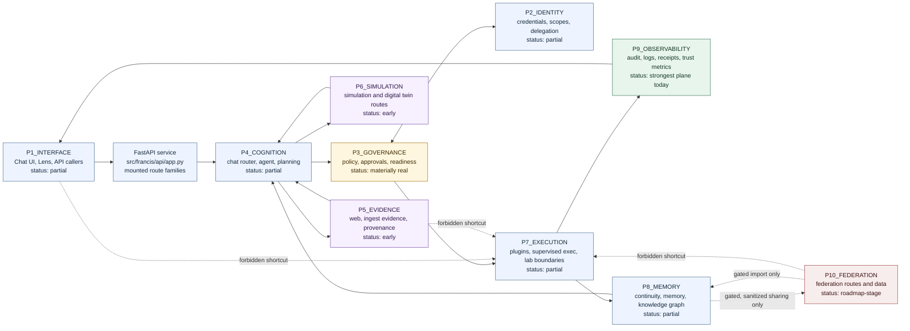
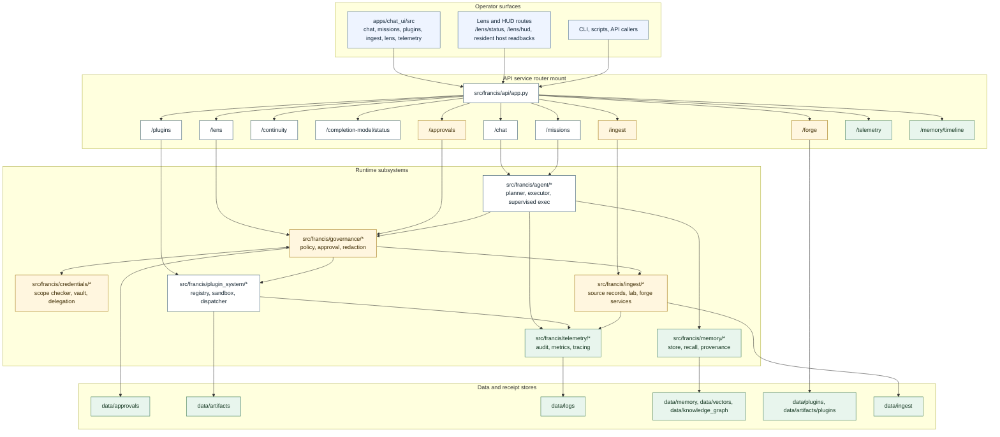
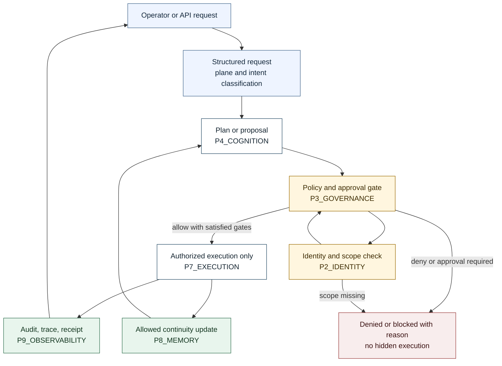

# Francis Current Build Wiring Diagram

This document is a current-state wiring snapshot for the Francis repo. It is
based on:

- `docs/operations/COMPLETION_LEDGER.md`
- `docs/canonical/BUILD_MANIFEST.md`
- `docs/PLANES.md`
- `meta/plane_map.yaml`
- `docs/ARCHITECTURE.md`
- `docs/BUILD_ORDER.md`
- `src/francis/api/app.py`
- `scripts/francis-completion-model.ps1 -Mode Status`

It is not a roadmap replacement and does not move any completion percentage.
The snapshot is documentation-only.

## Current Posture

Roadmap phase: `Phase 2`.

Current priority supported by this diagram:

- keep three worker lanes focused on Stage 17 / Capability Economy construction
- use Worker 4 for full-project CI and wiring verification
- preserve Stage 17 completion-model truth while Capability Economy work remains
  open
- keep the governed runtime spine inspectable: plan -> gate -> execute -> trace
  -> memory

The strongest current wiring is the governed runtime spine: observability and
governance are more real than the finished operator product surface.

Current audit status:

- This diagram is a repo-truth orientation artifact, not a completion claim.
- The 2026-06-20 Worker 4 CI/wiring pass verified the route-family inventory
  against `src/francis/api/app.py`, the runtime `create_app()` route table, the
  completion model, and the worker coordinator status readback.
- Full CI status must be read from the latest Worker 4 packet or Lead Builder
  validation notes; this file does not imply the full gate passed.

## Runtime Spine

Current interpretation:

- Interface exists through the React chat UI, Lens routes, and API routes, but
  the operator experience is not yet a complete ORB console.
- Cognition and execution paths exist, but the full product loop remains
  partial until planning, gates, execution, traces, memory, and UI readback are
  consistently wired for primary operator journeys.
- Governance is materially real, and observability is the strongest plane today.
- Evidence, simulation, and federation remain downstream or gated surfaces, not
  shortcuts into execution.

## Routed Surface Wiring

This is the current wiring shape, not a finished product claim. Several mounted
surfaces are readback-heavy or boundary-heavy. A route existing in the API does
not imply that the corresponding product capability is complete.

### Mounted Route-Family Inventory

Verified on 2026-06-20 from `src/francis/api/app.py` and a runtime
`create_app()` route table. This inventory records mounted families only; it
does not claim product completeness, closure, or execution authority.

| Prefix | Router family | Current wiring interpretation |
| --- | --- | --- |
| `/system` | `system` | foundation, settings, observer, ORB, and mutating-route authority readbacks |
| `/chat` | `chat` | operator interface ingress |
| `/chatgpt-voice` | `chatgpt_voice_bridge` | voice bridge contract, ingress, proof, and receipt surface |
| `/completion-model` | `completion_model` | read-only completion/status projection |
| `/attachments` | `attachments` | bounded attachment upload surface |
| `/continuity` | `continuity` | continuity briefing, prompt context, and ledger readback |
| `/artifacts` | `artifacts` | artifact inspection readback |
| `/approvals` | `approvals` | governance approval request/decision surface |
| `/plugins` | `plugins` | plugin registry, capability catalog, Stage 17 pack and apply surfaces |
| `/trust`, `/system/trust` | `trust` | trust policy/state readbacks and guarded mutation aliases |
| `/domains` | `domains`, `domain_learner` | domain records plus domain-learner status |
| `/simulation` | `simulation` | simulation status surface |
| `/operations` | `supervised_exec`, `operations` | supervised execution and operations readbacks |
| `/resilience` | `resilience` | resilience status surface |
| `/evolution` | `evolution` | evolution status surface |
| `/credentials` | `credentials` | identity, scopes, credential requests, delegation readbacks |
| `/developer-bridge` | `developer_bridge` | local developer bridge readbacks and bounded file/diff helpers |
| `/web_learning`, `/web-learning`, `/system/web_learning`, `/system/web-learning` | `web_learning` | web-learning policy, quarantine, records, and alias surfaces |
| `/federation` | `federation` | federation readbacks, pairing/trust contracts, and gated receipt surfaces |
| `/forge` | `forge` | Forge proposal, promotion, validation, and readiness readbacks/decisions |
| `/ingest` | `ingest` | code-born ingest, Lab, runner-boundary, and no-op receipt surfaces |
| `/explanation`, `/explanations` | `explanation` | explanation records and alias surface |
| `/memory/timeline` | `memory_timeline` | memory timeline readback |
| `/missions` | `missions` | mission creation, advancement, receipts, and recovery surfaces |
| `/reactor` | `reactor` | event, retry, review, deadletter, and operator-visibility surfaces |
| `/lens` | `lens`, `lens_mcp_status` | Lens, HUD, overlay, host, OS binding, and MCP readbacks/actions |
| `/telemetry` | `telemetry` | context, feedback, git, IDE, terminal, and status telemetry |
| `/executor` | `executor_substrate` | executor substrate reviews and closure-decision receipts |
| `/takeover` | `takeover` | takeover controls, panic stop, handback, and receipt surfaces |
| `/away` | `away` | away-mode budgets, progress samples, return briefings, and receipts |
| `/apprenticeship` | `apprenticeship` | teaching, replay, skillization, Forge handoff, and closure surfaces |
| `/knowledge-fabric` | `knowledge_fabric` | knowledge fabric status, retrieval, retention, and closure surfaces |
| `/trust-calibration` | `trust_calibration` | calibrated claim, visual readback, and closure-decision surfaces |
| `/adversarial-hardening` | `adversarial_hardening` | hardening contracts, regression suites, and closure decisions |
| `/swarm` | `swarm` | swarm contracts, completion review, and closure-decision surfaces |
| `/managed-copies` | `managed_copies` | managed-copy route family |
| `/industrial` | `industrial` | industrial assets, runs, safety, telemetry, and simulation surfaces |
| `/digital_twin` | `digital_twin` | digital twin status surface |
| `/controller` | static mount | optional controller UI if `apps/controller_ui` exists |

## Completion Model and Stage 17 Wiring

```mermaid
flowchart LR
  classDef source fill:#eef4ff,stroke:#41658a,color:#13273a
  classDef readback fill:#e8f5ed,stroke:#2f6f4e,color:#12351f
  classDef denied fill:#f8eded,stroke:#9a3c3c,color:#3a1111
  classDef future fill:#fff6df,stroke:#9a6a00,color:#3c2a00

  Ledger["Completion ledger<br/>docs/operations/COMPLETION_LEDGER.md"]:::source
  Manifest["Build manifest<br/>docs/canonical/BUILD_MANIFEST.md"]:::source
  Model["src/francis/completion_model.py<br/>read-only status projection"]:::readback
  Script["scripts/francis-completion-model.ps1<br/>-Mode Status"]:::readback
  Route["GET /completion-model/status"]:::readback
  Decision["next_continue_decision<br/>selects latest open Stage 17 gap"]:::readback
  Denial["selected-gap contract<br/>writes_repo=false<br/>writes_data=false<br/>execution and mutation authority denied"]:::denied
  Evidence["Capability pack evidence<br/>metadata, quality standards, validation receipts, proposal lineage"]:::readback
  Review["Operator review decisions<br/>closed by fingerprinted receipt-only apply"]:::readback
  ProposalEvidence["Proposal evidence readiness<br/>stage17_capability_library_promotion_readiness"]:::future
  ProposalReview["Capability library proposal review<br/>blocked until proposal evidence is ready"]:::future
  Promotion["Capability library promotion<br/>blocked until readiness and review pass"]:::future
  Closure["Stage 17 closure matrix<br/>criteria 1-5 ready, criterion 6 partial"]:::future

  Ledger --> Model
  Manifest --> Model
  Model --> Script
  Model --> Route
  Route --> Decision
  Script --> Decision
  Decision --> Denial
  Denial --> Evidence
  Evidence --> Review
  Review --> ProposalEvidence
  ProposalEvidence --> ProposalReview
  ProposalReview --> Promotion
  Promotion --> Closure
```

Current completion-model readback truth:

- `current_phase` is `Phase 2`.
- `stage17_status.status` is `open`.
- The artifact reconstruction queue is closed again: latest durable receipt
  `stage17_artifact_reconstruction_batch_1782065757_43749ec7_receipt` moved the
  reopened reconstruction queue `1 -> 0` for
  `legacy.generated.capabilityoperatorreviewdecisionplugin`.
- Pack operator review decisions are receipt-backed and closed for the current
  ready surface after fingerprinted bulk applies.
- The capability library operator surface is ready for explicit promotion with
  50 ready packs and 2,438 staged capabilities.
- Promotion remains blocked by `stage17_capability_library_promotion_readiness`:
  1,263 capabilities still lack proposal evidence and proposal review.
- The closure matrix reports criteria 1 through 5 ready and criterion 6 partial;
  this is not a Stage 17 closure claim.
- The selected Stage 17 gap is read-only worker routing, not apply authority.
- The selected gap is not queue-count evidence.
- The selected gap is not proposal-evidence reference proof.
- The selected gap is not publication proof.
- The selected gap is not worker-readback, worker-publication handoff, or worker
  execution liveness proof.
- The completion model does not declare numeric baseline percentages.

## Authority Boundaries

Protected shortcuts:

- No direct `P1_INTERFACE -> P7_EXECUTION`.
- No direct `P5_EVIDENCE -> P7_EXECUTION`.
- No direct `P10_FEDERATION -> P7_EXECUTION`.
- No privileged action without `P3_GOVERNANCE` plus `P2_IDENTITY`.
- Readbacks can expose status, blockers, receipts, and next required gates; they
  do not grant mutation or execution authority by themselves.

## Plane Readiness Snapshot

| Plane | Current status | Current wiring signal | Main remaining risk |
| --- | --- | --- | --- |
| `P0_FOUNDATION` | partial | bootstrap, settings, kernel paths, API app startup | build contract still needs full ORB alignment |
| `P1_INTERFACE` | partial | chat UI, Lens, API route families | operator must still infer too much ORB state |
| `P2_IDENTITY` | partial | credentials, scope checker, delegation, API permission gates | identity is not yet unmistakable across every privileged route |
| `P3_GOVERNANCE` | materially real | approvals, policy engine, readiness, redaction, mutation matrix | must keep closing bypass and consistency gaps |
| `P4_COGNITION` | partial | chat router, agent, planning/proposal modules | plan-to-gate-to-result flow is not yet uniformly productized |
| `P5_EVIDENCE` | early | web/evidence docs, ingest provenance, explanation evidence | evidence must stay provenance-rich and injection-safe |
| `P6_SIMULATION` | early | simulation, industrial, digital twin routes | not yet a trusted production validation surface |
| `P7_EXECUTION` | partial | supervised exec, plugin runtime, ingest lab boundaries | broader authorization, sandbox, artifact, and explanation consistency remains |
| `P8_MEMORY` | partial | continuity, mission receipts, memory store/recall/provenance | retrieval and operator-facing continuity story need strengthening |
| `P9_OBSERVABILITY` | strongest plane today | audit, logs, metrics, traces, completion model readbacks | must avoid becoming a backdoor memory store or fake progress signal |
| `P10_FEDERATION` | roadmap-stage | federation routes and data folders exist | must not bypass sanitization, trust, governance, or execution gates |

## Use

Use this file as a fast orientation diagram before choosing or reviewing a
bounded implementation slice. For authoritative shipped posture, read the
completion ledger first. For target architecture, read the canonical roadmap and
ORB plane documents.
